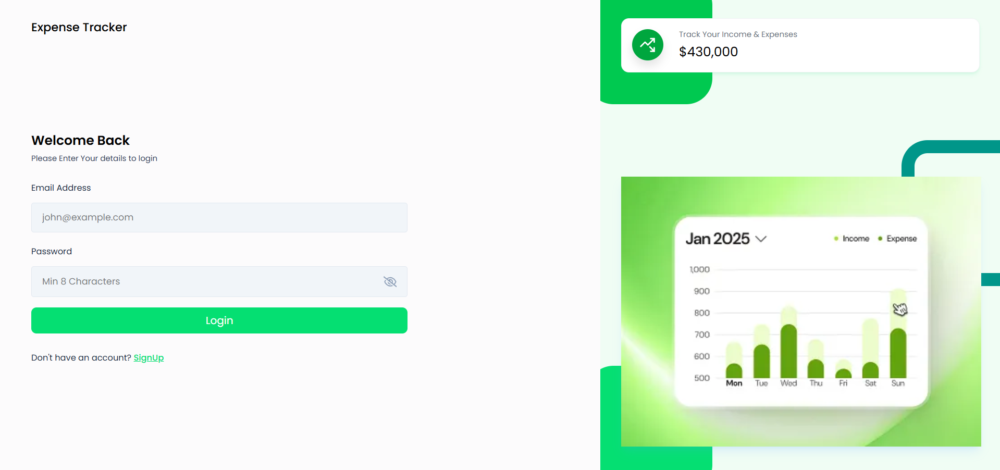
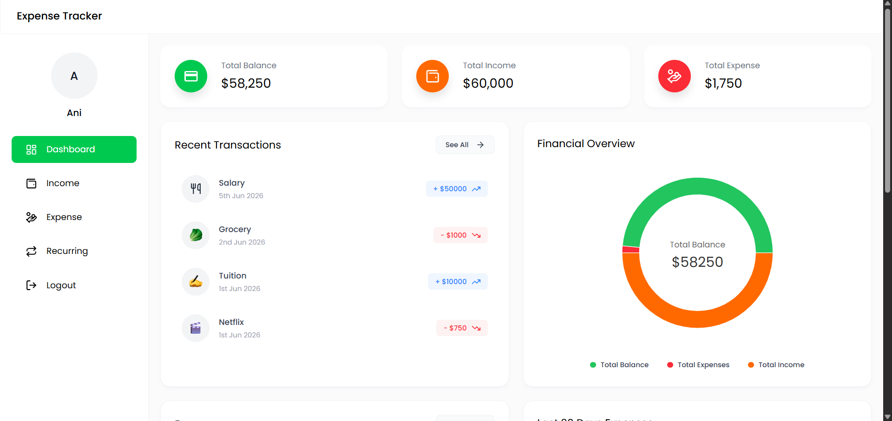
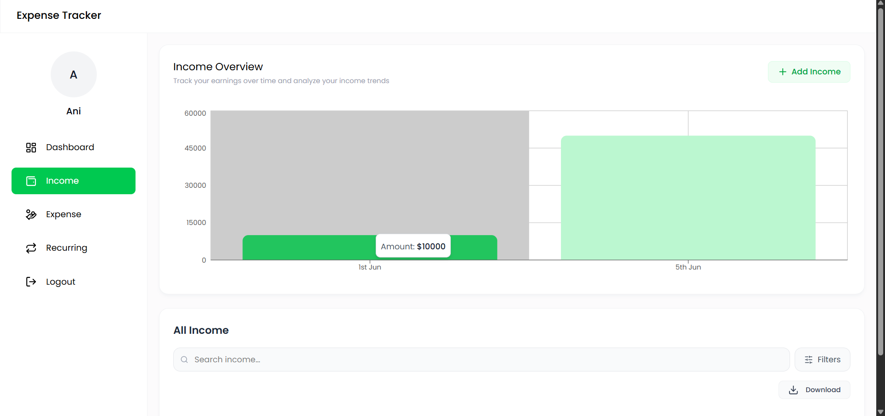
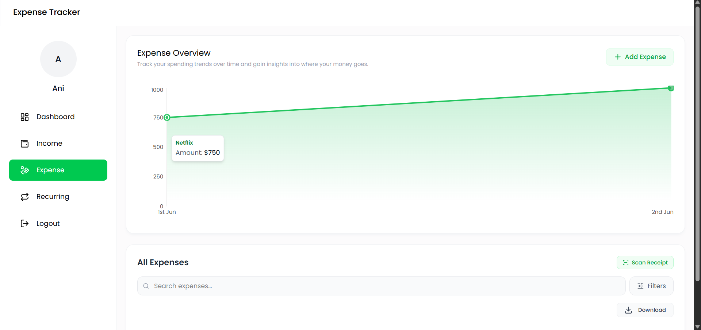

# 💸 Expense Tracker

A full-stack **MERN** web application to track your income and expenses, visualize spending patterns, and manage your finances — all in one place.

---

## 🖥️ App Preview

|                            Login                            |                         Dashboard                          |
| :---------------------------------------------------------: | :--------------------------------------------------------: |
|  |  |

|                         Income Page                          |                         Expense Page                          |
| :----------------------------------------------------------: | :-----------------------------------------------------------: |
|  |  |

---

## 🚀 Features

- 🔐 **User Authentication** — Secure signup & login with JWT-based auth
- 💰 **Income Management** — Add, view, and delete income entries with emoji support
- 🧾 **Expense Management** — Track and categorize your expenses effortlessly
- 📊 **Charts & Analytics** — Visual breakdowns via interactive Recharts graphs
- 🔄 **Recurring Transactions** — Automate your salary, rent, and subscriptions with custom intervals (Daily/Weekly/Monthly/Yearly)
- 🔍 **Advanced Search & Filters** — Find transactions instantly by text, category, date range, or amount
- 📷 **Receipt Scanner (OCR)** — Upload receipt images/PDFs to auto-extract amount, date, and category
- 🏠 **Dashboard Overview** — Quick summary of balance, income, and expenses
- 📥 **Export to Excel** — Download income/expense reports as `.xlsx` files
- 🖼️ **Profile Picture Upload** — Upload and manage user avatars via Multer
- 🛡️ **Protected Routes** — API and frontend routes secured by middleware

---

## 🛠️ Tech Stack

### 🎨 Frontend

| Technology          | Purpose                     |
| ------------------- | --------------------------- |
| React 19            | UI framework                |
| Vite                | Build tool & dev server     |
| Tailwind CSS v4     | Styling                     |
| React Router DOM v7 | Client-side routing         |
| Recharts            | Data visualization          |
| Tesseract.js        | OCR engine for receipt scan |
| Axios               | HTTP client                 |
| React Hot Toast     | Toast notifications         |
| React Icons         | Icon library                |
| Moment.js           | Date formatting             |
| Emoji Picker React  | Emoji selection for entries |

### ⚙️ Backend

| Technology           | Purpose                 |
| -------------------- | ----------------------- |
| Node.js + Express 5  | REST API server         |
| MongoDB + Mongoose   | Database & ODM          |
| JSON Web Token (JWT) | Authentication          |
| bcryptjs             | Password hashing        |
| Multer               | File/image uploads      |
| xlsx                 | Excel report generation |
| dotenv               | Environment config      |
| CORS                 | Cross-origin requests   |

---

## 📁 Project Structure

```
Expense Tracker/
├── backend/
│   ├── config/          # MongoDB connection
│   ├── controllers/     # Route handler logic
│   ├── middleware/      # Auth middleware
│   ├── models/          # Mongoose schemas (User, Income, Expense, Recurring)
│   ├── routes/          # API route definitions
│   │   ├── authRoutes.js
│   │   ├── incomeRoutes.js
│   │   ├── expenseRoutes.js
│   │   ├── recurringRoutes.js
│   │   ├── receiptRoutes.js
│   │   └── dashboardRoutes.js
│   ├── uploads/         # Uploaded images
│   ├── server.js        # Express app entry point
│   └── package.json
│
└── frontend/
    └── expense-tracker/
        ├── public/
        └── src/
            ├── components/
            │   ├── Cards/
            │   ├── Charts/
            │   ├── Dashboard/
            │   ├── Expense/
            │   ├── Income/
            │   ├── Recurring/   # New Recurring components
            │   ├── Receipt/     # Receipt Scanner component
            │   ├── Inputs/      # SearchFilters component
            │   ├── layouts/
            │   ├── DeleteAlert.jsx
            │   ├── EmojiPickerPopup.jsx
            │   └── Modal.jsx
            ├── context/     # React context (global state)
            ├── hooks/       # Custom React hooks
            ├── pages/
            │   ├── Auth/    # Login & Signup pages
            │   └── Dashboard/
            ├── utils/       # Helper functions
            ├── App.jsx
            └── main.jsx
```
